# Ortense's Neovim Config

This is my personal neovim config, feel free to use as is or fork and customize for better match with your workflow.

I use some plugins that help me in my day work.

## UI

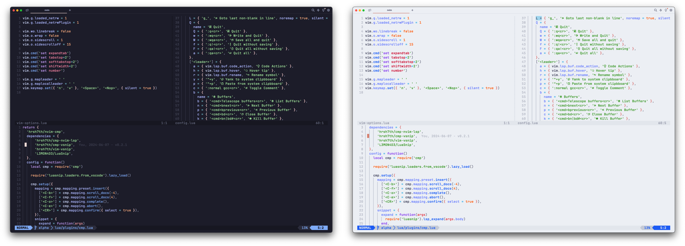

Starting by the theme I use the **mocha** flavored [Catppuccin](https://github.com/catppuccin/nvim), this plugin also have all other variants.
As status line I use [lualine](https://github.com/nvim-lualine/lualine.nvim) with minimal config and same color schema.

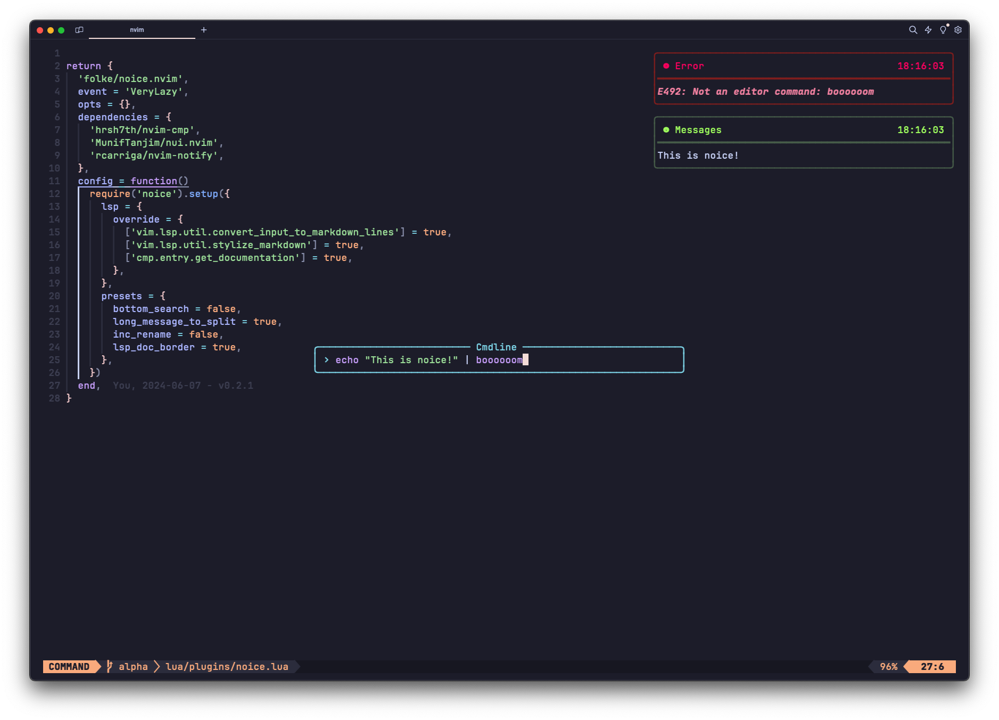

For command pallet and notifications, [ noice ](https://github.com/folke/noice.nvim) create a realy good experience with _floating popups_

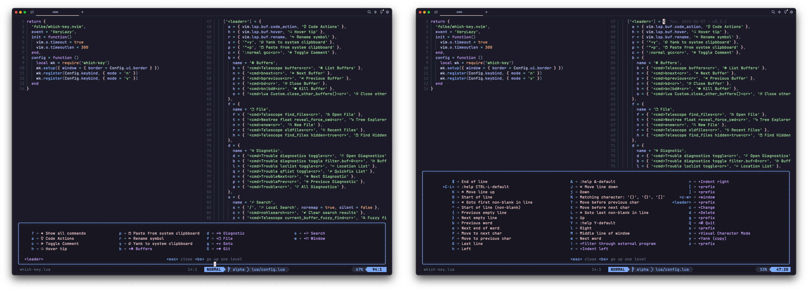

[Which-key](https://github.com/folke/which-key.nvim) make all shortcuts documented and discoverable, I just press `<space>` and flow the command.

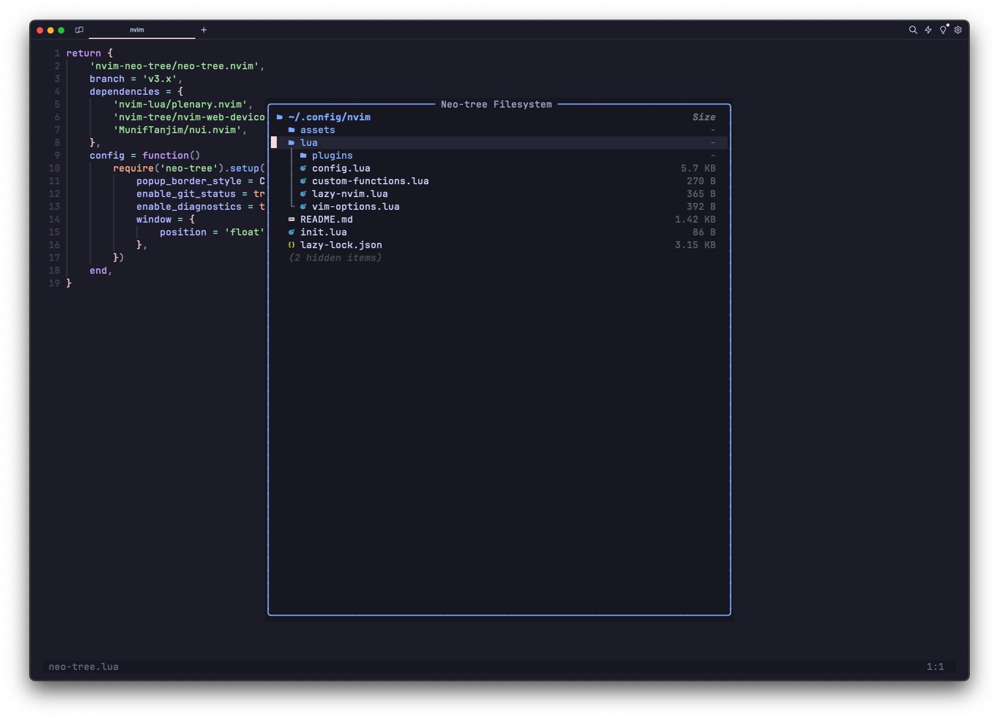

[Neo-tree](https://github.com/nvim-neo-tree/neo-tree.nvim) is my floating tree-view, easy and helpful to create, delete or move files.

## Navigation

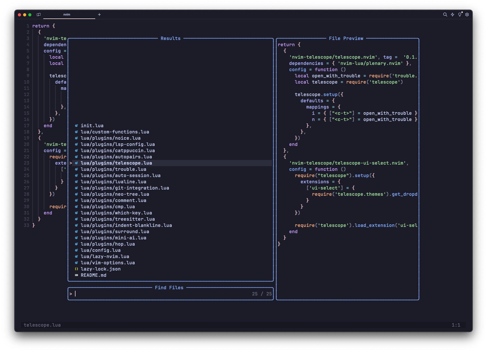

[Telescope](https://github.com/nvim-telescope/telescope.nvim) is by far the most used plugin here, extremily helpful to jump between files, buffers, symbols and more.

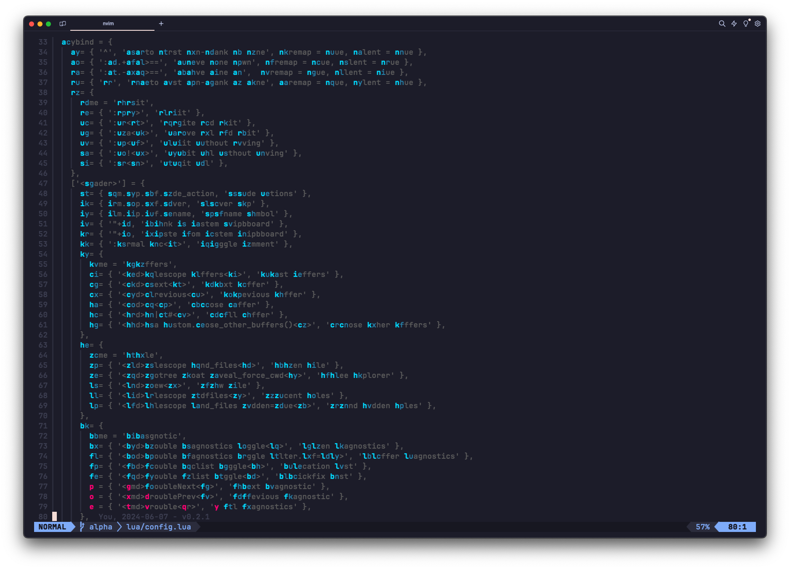

To navigate throught the text I like [Hop](https://github.com/hadronized/hop.nvim), for me is the fast way to move to specific points of the code. 

## Git integration

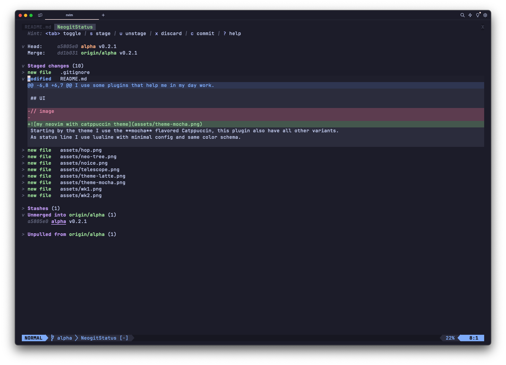

[Neogit](https://github.com/NeogitOrg/neogit) is the main integrated UI for git, but to be fair I use [LazyGit](https://github.com/jesseduffield/lazygit) more then Neogit, both are really good options for git TUI.

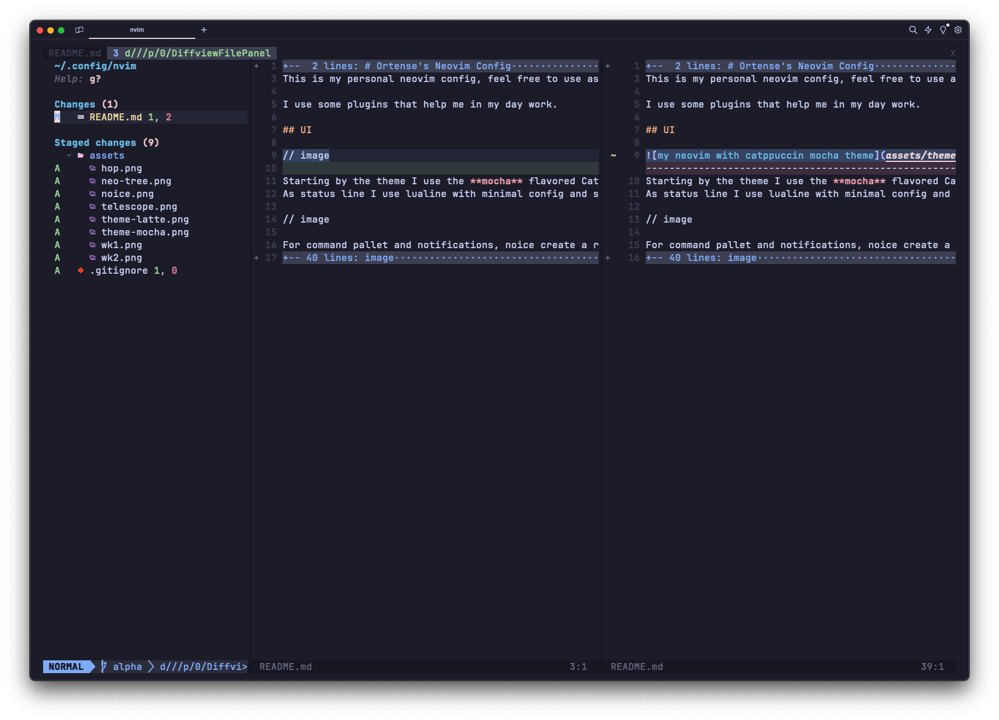

[Diffview](https://github.com/sindrets/diffview.nvim) is a good way to see file changes side-by-side.

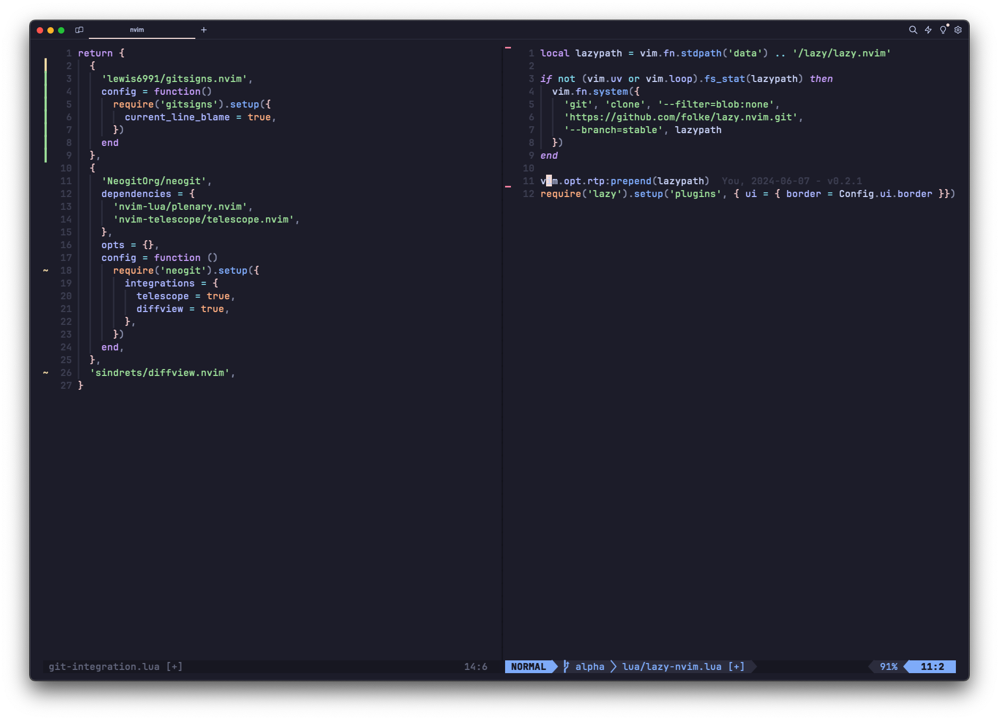

Finally, [Gitsigns](https://github.com/lewis6991/gitsigns.nvim) adds decoration, inline blame, preview hunks and more 

## Dependency management

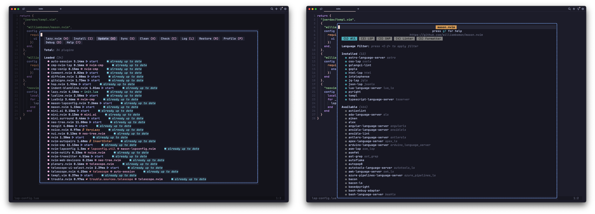

[Lazy](https://github.com/folke/lazy.nvim) and [Mason](https://github.com/williamboman/mason.nvim) are a amazing duo, all works good and help me to mantain an organized and modular setup.

## Code manipulation

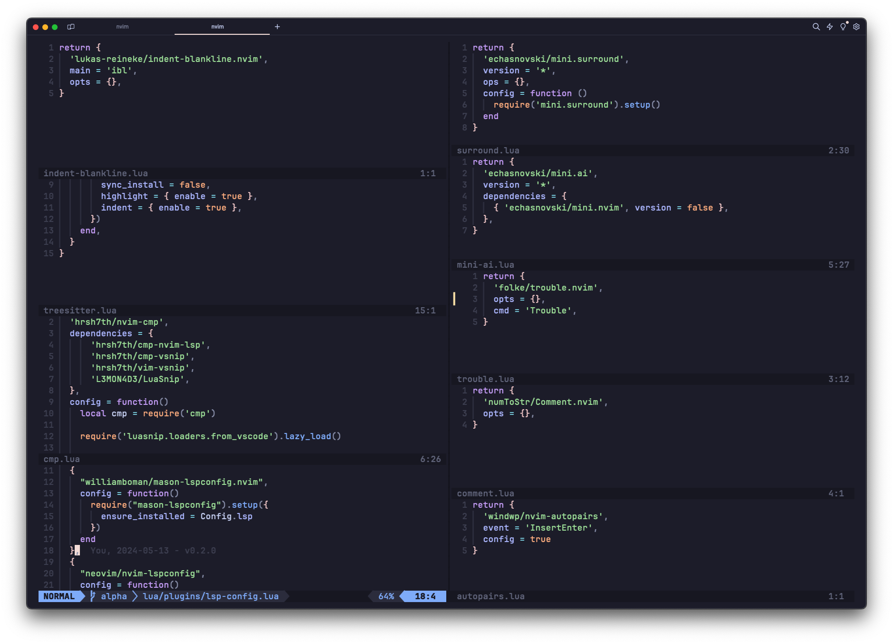

Under the hood has a lot of plugins thats provides an amazing and smooth code experience on neovin, my personal picks are:

- [mason-lspconfig](https://github.com/williamboman/mason-lspconfig.nvim) to make the LSP setup easy
- [cmp](https://github.com/hrsh7th/nvim-cmp) and [LuaSnip](https://github.com/L3MON4D3/LuaSnip) for code completion an snipets
- [indent-blankline](https://github.com/lukas-reineke/indent-blankline.nvim) helpful for identation
- [treesitter](https://github.com/nvim-treesitter/nvim-treesitter) must have for a lot of langs support
- [mini.surround](https://github.com/echasnovski/mini.surround) and [mini.ai](https://github.com/echasnovski/mini.ai) for text manipulation
- [autopairs](https://github.com/windwp/nvim-autopairs) for multiple characters
- [auto-session](https://github.com/rmagatti/auto-session) for session management
- [comment](https://github.com/terrortylor/nvim-comment) for smart comments
- [trouble](https://github.com/folke/trouble.nvim) is an amazing diagnostic tool

## Conclusion

This is not a neovim distribution, is only my personal setup, this repo is more a about my jorney with neovim than a guide or a recomendation.
Anyway this works realy well for me and I'm happy to share.
The process to learn and understand all of then could be a bit hard, but is cool, learn new thinks is cool.

Neovim is a good tool, but could not be the best for you, if you looking for a complete distribution, my personal recomendation is [NvChad](https://nvchad.com/), if you just want to learn vim motions maybe the better option is a plugin in your favorite editor or IDE.

Tks!
