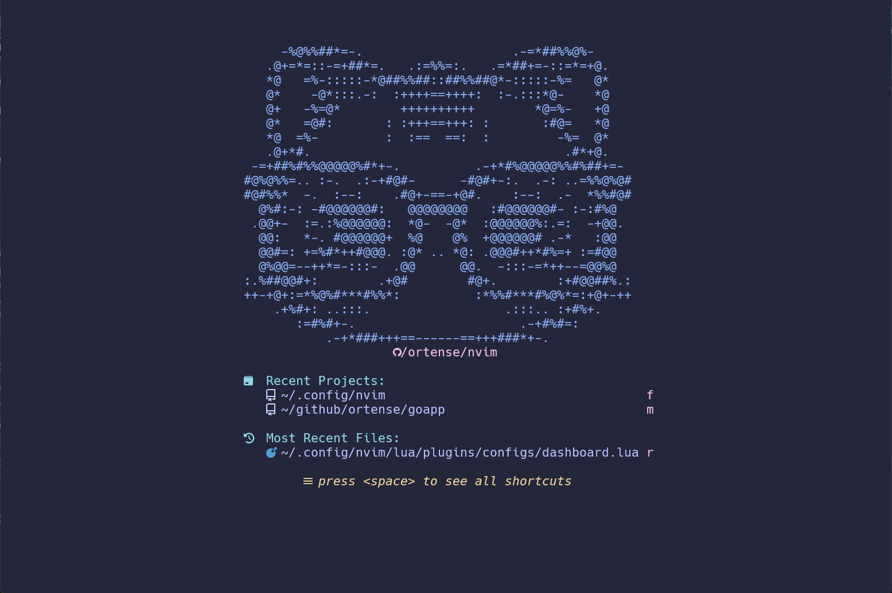
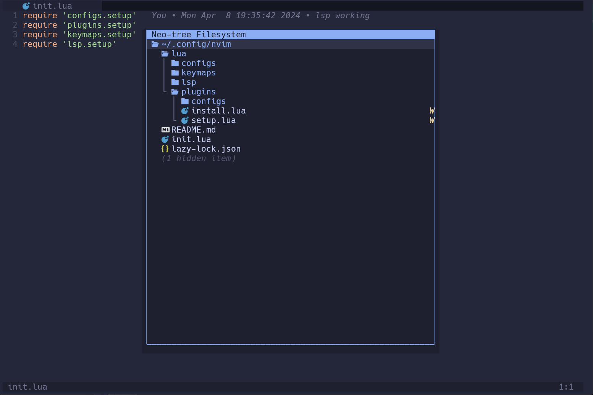
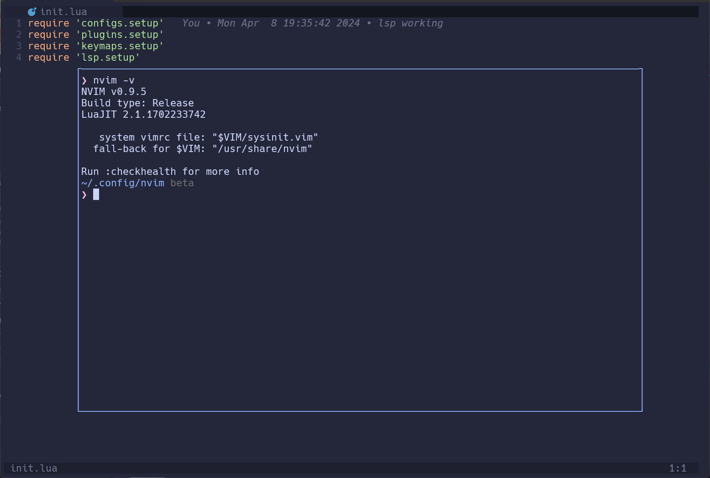
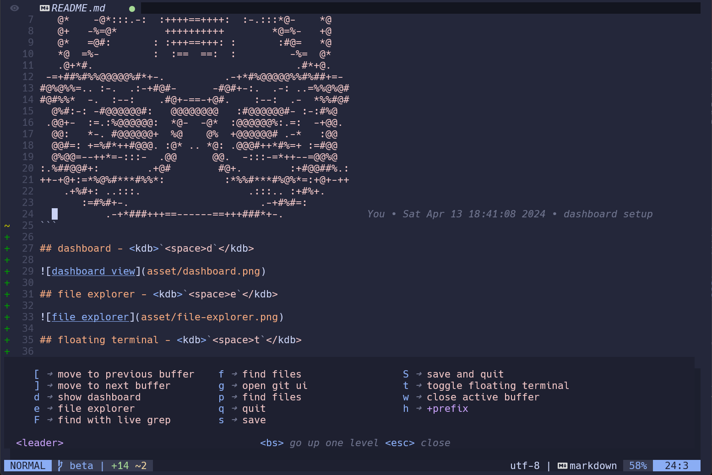

# @ortense/neovim

This is my custom condig of neovim with my favorit plugins.

## dashboard - <kdb>`<space>d`</kdb>



## file explorer - <kdb>`<space>e`</kdb>



## floating terminal - <kdb>`<space>t`</kdb>



## git integration and more



## install

1. create a backup of your current config
```sh
cp ~/.config/nvim ~/.config/nvim.bkp
```

2. clone this repository and open nvim
```sh
git clone https://github.com/ortense/nvim ~/.config/nvim && nvim
```

3. At first open Lazy will install all dependencies

4. Now you can delete the `.git` folder